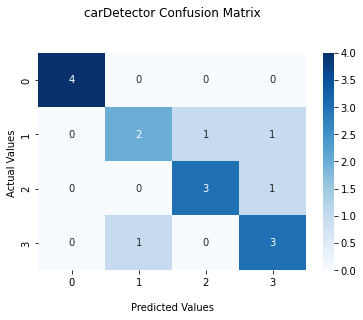
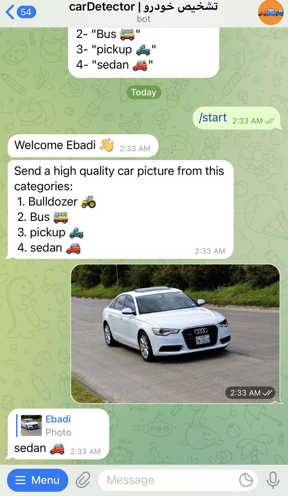

# Car type detector by CNN model

* Accuracy

|               | Loss  | Accuracy             |
| :----------- | :------: | :-------------: |
 Train         | 0.2476   | 89.59%
 Validation    | 1.6409   | 64.97%
 Test          | 1.0413   | 75.00%
 
 ----------------------------------------------------------------------------------------------------------------
 * data

Pinterest Crawler is used for data collected in 4 categories of cars.
https://github.com/SajjadAemmi/Pinterest-Crawler

 data are available from this link:

   <a id="raw-url" href="https://drive.google.com/drive/folders/1Sx_qltTBGVHJ3F5pfbCesCdBoeQ_zY4Z?usp=sharing">Download data</a>

Car Categories:
1. "Bulldozer 🚜"
2. "Bus 🚌"
3. "pickup 🛻"
4. "sedan 🚗"

 ----------------------------------------------------------------------------------------------------------------
 * model are available from this link:

     <a id="raw-url" href="https://drive.google.com/file/d/1RKd3vfQbSCWL_Mqb1mY_tXoZOcFLAokm/view?usp=sharing">Download model</a>
    
 -----------------------------------------------------------------------------------------------------------------
 * Inference
  
  
    carDetector_Inference.py --data [path]
 ------------------------------------------------------------------------------------------------------------------
 
  * Confusion Matrix

    
 -------------------------------------------------------------------------------------------------------------------
 * wandb
 
   <a id="raw-url" href="https://wandb.ai/fereshteh_ebadi/car_Detector?workspace=user-fereshteh_ebadi">Train model charts</a>
   

 -------------------------------------------------------------------------------------------------------------------
 * Telegram bot
   You can test the program via Telegram bot!
   Bot : t.me/carDetector_bot
   
   sample:
    
 
 
