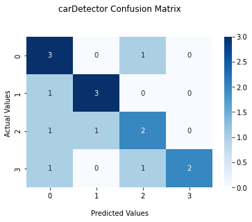

# Car type detector by CNN model

* Accuracy

|               | Loss  | Accuracy             |
| :----------- | :------: | :-------------: |
 Train         | 0.3949   | 85.65%
 Validation    | 1.8153   | 47.80%
 Test          | 1.5265   | 62.50%
 
 ----------------------------------------------------------------------------------------------------------------
 * data

Pinterest Crawler is used for data collected in 4 categories of cars.
https://github.com/SajjadAemmi/Pinterest-Crawler

Car Categories:
1. "Hatchback 🚙"
2. "Lorry 🚛"
3. "pickup 🛻"
4. "sedan 🚗"

 ----------------------------------------------------------------------------------------------------------------
 * model are available from this link:

     <a id="raw-url" href="https://drive.google.com/file/d/14A46sIa6PpfCinJi60H35Re9sodxjenO/view?usp=sharing">Download model</a>
    
 -----------------------------------------------------------------------------------------------------------------
 * Inference
  
  
    carDetector_Inference.py --data [path]
 ------------------------------------------------------------------------------------------------------------------
 
  * Confusion Matrix

    
 -------------------------------------------------------------------------------------------------------------------
 * wandb
 
   <a id="raw-url" href="https://wandb.ai/fereshteh_ebadi/car%20type%20Detector/runs/3q3d7y29?workspace=user-fereshteh_ebadi">Train model charts</a>
   

 
 
 
