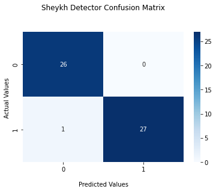

# Sheykh detector by VGG16 model

* Accuracy

|              | Loss  | Accuracy             |
| :----------- | :------: | :-------------: |
 Train         | 0.0211   | 99.26%
 Validation    | 0.0898   | 96.97%
 Test          | 0.0882   | 98.15%
 
 ----------------------------------------------------------------------------------------------------------------
 * data

To access the data, contact Mr. SajjadAemmi :

https://github.com/SajjadAemmi

Categories:

1- Normal people 👨 / 👩

2- Sheykh 👳

 ----------------------------------------------------------------------------------------------------------------
 * model are available from this link:

     <a id="raw-url" href="https://drive.google.com/file/d/1-ZSHA9CCSiwWJ2xCUzcc0_SDqiH3i1bq/view?usp=sharing">Download model</a>
    
 -----------------------------------------------------------------------------------------------------------------
 * Inference
  
  
    SheykhDetector_Inference.py --data [path]
 ------------------------------------------------------------------------------------------------------------------
 
  * Confusion Matrix

    
 -------------------------------------------------------------------------------------------------------------------
 * wandb
 
   <a id="raw-url" href="https://wandb.ai/fereshteh_ebadi/SheykhDetector/runs/1c47lthc?workspace=user-fereshteh_ebadi">Train model charts</a>
   

 -------------------------------------------------------------------------------------------------------------------
 * Telegram bot
   You can test the program via Telegram bot!
   
   Bot : t.me/SheykhDetector_bot
   
   sample:
    
    
 
 
