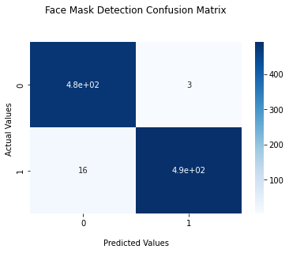

# Face Mask Detector by mobileNetV2 model

* Accuracy

|              | Loss  | Accuracy             |
| :----------- | :------: | :-------------: |
 Train         | 0.0153   | 99.45 %
 Validation    | 0.0257    | 99.25%
 Test          | 0.0260    | 98.99%
 
 ----------------------------------------------------------------------------------------------------------------
 * data

dataset are available from this link:

    <a id="raw-url" href="https://www.kaggle.com/ashishjangra27/face-mask-12k-images-dataset">Download Dataset</a>

 ----------------------------------------------------------------------------------------------------------------
 * model are available from this link:

     <a id="raw-url" href="https://drive.google.com/file/d/1-Z7njUJgVKscKybfBdl9cNTItAUn05OV/view?usp=sharing">Download model</a>
    
 -----------------------------------------------------------------------------------------------------------------
 * Inference
  
  
    Run Inference.py
 ------------------------------------------------------------------------------------------------------------------
 
  * Confusion Matrix

    
 -------------------------------------------------------------------------------------------------------------------
 * wandb
 
   <a id="raw-url" href="https://wandb.ai/fereshteh_ebadi/Face_Mask?workspace=user-fereshteh_ebadi">Train model charts</a>
   

 -------------------------------------------------------------------------------------------------------------------
